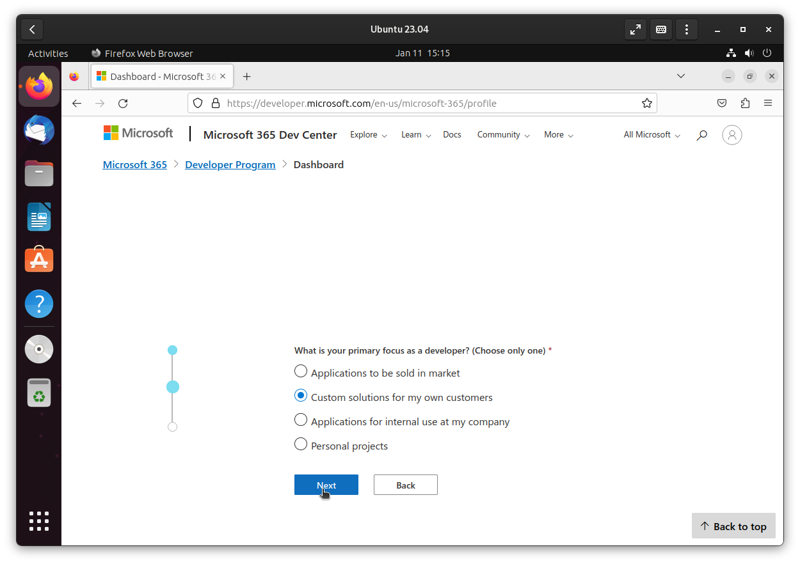
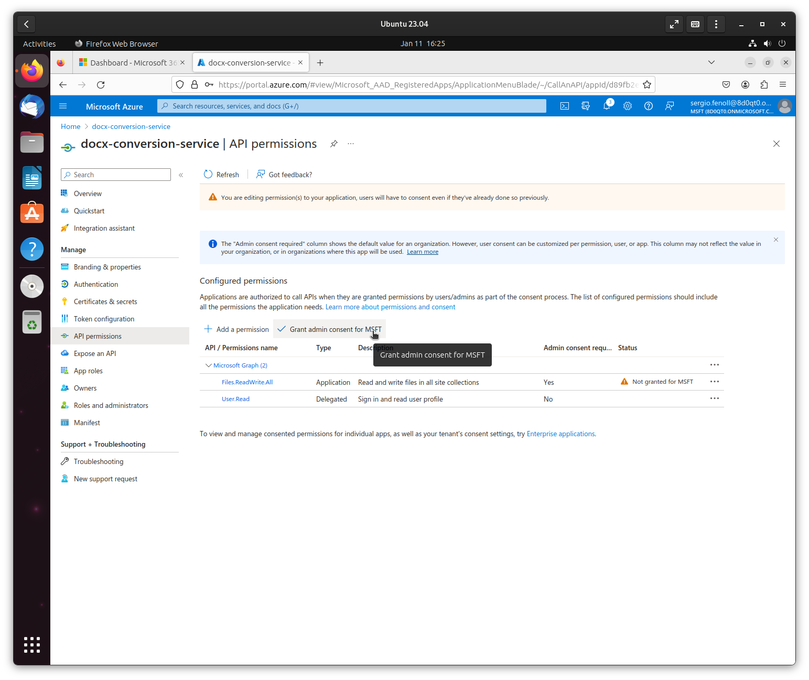

# Setting up Microsoft Developer Program

To use and develop this service you will need an Azure application and a user. If you don't have them, this tutorial will guide you through the setup of your Microsoft Developer Program account and the rest of the requirements needed for this service to function.

## Setting up your Microsoft Account

Navigate to the [Microsoft 365 Developer Program](https://developer.microsoft.com/en-us/microsoft-365/dev-program). If you already have a Microsoft account, log in, otherwise create one. Afterwards click the "Join now" button and go through the form to enter the developer program.

*Make sure to select the Instant sandbox, as it will contain useful default configuration!*

*Make sure to remember the password you provide here, as you will need it later to log into the Azure portal.*

*You will need to provide a valid phone number to finish this process.*

After going through the form you should have created a sandbox that allows you to create all the resources needed for this service. Make note of the administrator email address, you will need it to log into the Azure portal.

## Setting up the Azure application

Navigate to the [Azure portal](http://portal.azure.com) and log in with the admin account you just created.

Use the search bar to look for "App registrations" and click it.

You will now create a new app registration that will be used for this service.

Write down the **Application (client) ID** and the **Directory (tenant) ID**, they're the values of the environment variables `CLIENT_ID` and `TENANT_ID`.

You still need a way for your service to authenticate with Microsoft's infrastructure, for that you will need a "client secret". Go to the **Certificates & secrets** tab and create a new client secret (the name you give it doesn't really matter).

Make sure to store the secret's value, as soon as you leave this page the value gets hidden and you need it for the `CLIENT_SECRET` environment variable.

Your application still needs the correct permissions for uploading files. Go to the **API permissions** tab and add a new permission.

The permission type must be **Microsoft Graph Application permission**.

The permission itself is **Files.ReadWrite.All**.

After adding the permission you still need to **Grant admin consent** for the permission.

You still need to get a user ID. You can use your admin user for this, as the service just needs to be able to upload files to the user's OneDrive root.

To get the ID go to **Users** in the Azure portal.

Get the ID of the user you want to use by clicking on their name.

Assign the value of the **Object ID** field to the `USER_ID` environment variable.

